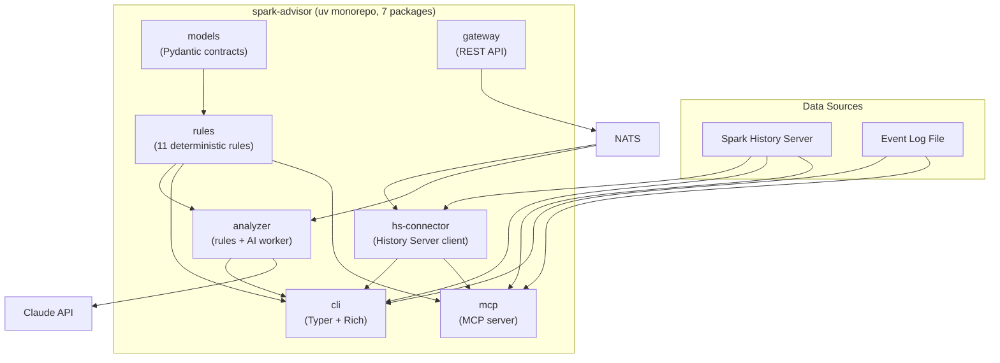

<div align="center">

  
  <p>AI-powered Apache Spark job analyzer and configuration advisor.</p>
  <p><strong>v<!-- x-release-please-version -->0.1.7<!-- /x-release-please-version --></strong></p>
  <p><em>Stop guessing Spark configs. Let data and AI tell you what's wrong.</em></p>

  <p>
    <a href="https://github.com/pstysz/spark-advisor/actions/workflows/ci.yml"></a>
    
    
    
  </p>
  <p>
    
    
    
    
    
    
  </p>

  <p>
    <a href="#features">Features</a> •
    <a href="#quick-start">Quick Start</a> •
    <a href="#cli-usage">CLI Usage</a> •
    <a href="#mcp-server">MCP Server</a> •
    <a href="#microservices">Microservices</a> •
    <a href="#kubernetes">Kubernetes</a> •
    <a href="#architecture">Architecture</a> •
    <a href="#development">Development</a>
  </p>

</div>

---

```
$ spark-advisor analyze sample_event_logs/sample_etl_job.json

╭───────────────────────────── Spark Job Analysis ─────────────────────────────╮
│   App ID                application_1234567890_0001                          │
│   App Name              SampleETLJob                                         │
│   Duration              6.7 min (400s)                                       │
│   Stages                2                                                    │
│   Total Tasks           5                                                    │
│   Shuffle Partitions    200                                                  │
│   Executors             0                                                    │
╰──────────────────────────────────────────────────────────────────────────────╯

Issues Found

  🔴 CRITICAL: Data skew in Stage 1
    Max task duration (335000.0ms) is 27.9x the median (12000.0ms)
    → Enable AQE: spark.sql.adaptive.enabled=true, spark.sql.adaptive.skewJoin.enabled=true

  🔴 CRITICAL: Disk spill in Stage 1
    22.2 GB spilled to disk — data doesn't fit in memory
    → Increase spark.executor.memory or spark.sql.shuffle.partitions

  🟡 WARNING: High GC pressure in Stage 1
    GC time is 24% of total task time
    → Increase executor memory or reduce data cached per task
```

## How it works

```
Event Log / History Server  →  Rules Engine (11 rules)  →  AI Advisor (optional)  →  Report
                                  (free, fast)              (Claude API, ~$0.02)
```

1. **Data source** — parse Spark event log files or fetch from History Server REST API
2. **Rules engine** — 11 deterministic checks: data skew, disk spill, GC pressure, partition sizing, executor idle, task failures, small files, broadcast join, serializer choice, dynamic allocation, memory overhead
3. **AI advisor** (optional) — Claude analyzes metrics + rule findings, identifies causal chains between related problems, suggests concrete config values

The rules engine runs for free and catches known patterns. The AI layer adds contextual reasoning — it understands that skew in Stage 3 *causes* spill in Stage 4, which *causes* GC pressure, and recommends fixing the root cause.

## Features

- **11 deterministic rules** detecting data skew, GC pressure, disk spill, wrong partition count, and more
- **AI advisor** with Claude API — prioritized recommendations with causal chains and concrete config values
- **Agent mode** — multi-turn Claude analysis where AI autonomously explores job data using 6 tools
- **MCP server** — use spark-advisor as tools in Claude Desktop, Cursor, or any MCP client
- **3 microservices** — NATS-based distributed pipeline (gateway, analyzer, hs-connector)
- **Streaming parser** — processes 100MB+ event log files line-by-line without loading into memory
- **Rich CLI** — tables, colors, severity badges, suggested spark-defaults.conf

## Quick Start

### Prerequisites

- Python 3.12+
- [uv](https://docs.astral.sh/uv/) (modern Python package manager)

### Install

```bash
git clone https://github.com/pstysz/spark-advisor.git
cd spark-advisor
uv sync --all-packages
```

### Analyze

```bash
# Rules-only (no API key needed)
cd packages/spark-advisor-cli
uv run spark-advisor analyze ../../sample_event_logs/sample_etl_job.json --no-ai

# With AI analysis (requires ANTHROPIC_API_KEY)
export ANTHROPIC_API_KEY=sk-ant-...
uv run spark-advisor analyze ../../sample_event_logs/sample_etl_job.json
```

## What it detects

| Rule               | Condition                                                | Severity                            |
|--------------------|----------------------------------------------------------|-------------------------------------|
| Data skew          | max/median task duration > 5x                            | CRITICAL if >10x, WARNING if >5x    |
| Disk spill         | diskBytesSpilled > 0                                     | CRITICAL if >1GB, WARNING if >0.1GB |
| GC pressure        | GC time > 20% of task time                               | CRITICAL if >40%, WARNING if >20%   |
| Shuffle partitions | partition size far from 128MB target                     | WARNING                             |
| Executor idle      | slot utilization < 40%                                   | CRITICAL if <20%, WARNING if <40%   |
| Task failures      | failed_task_count > 0                                    | CRITICAL if >=10, WARNING if >0     |
| Small files        | avg input bytes/task < 10MB                              | CRITICAL if <1MB, WARNING if <10MB  |
| Broadcast join     | threshold disabled with shuffle stages                   | WARNING if disabled, INFO if < 10MB |
| Serializer choice  | Java serializer with shuffle stages                      | INFO                                |
| Dynamic allocation | enabled without bounds, or disabled with low utilization | WARNING                             |
| Memory overhead    | GC > 20% AND memory utilization > 80%                    | WARNING                             |

All thresholds are configurable via `Thresholds` model.

## CLI Usage

### `analyze` — analyze a Spark job

```bash
# From event log file
spark-advisor analyze /path/to/event-log.json.gz

# From History Server
spark-advisor analyze app-20250101120000-0001 -hs http://yarn:18080

# With AI analysis (default if ANTHROPIC_API_KEY is set)
spark-advisor analyze /path/to/event-log.json.gz

# Without AI (rules only)
spark-advisor analyze /path/to/event-log.json.gz --no-ai

# Agent mode (multi-turn AI with tool use)
spark-advisor analyze /path/to/event-log.json.gz --agent

# Verbose mode (per-stage breakdown)
spark-advisor analyze /path/to/event-log.json.gz --verbose

# JSON output
spark-advisor analyze /path/to/event-log.json.gz --format json

# Save suggested config to file
spark-advisor analyze /path/to/event-log.json.gz -o spark-defaults.conf

# Use specific Claude model
spark-advisor analyze /path/to/event-log.json.gz --model claude-sonnet-4-6
```

| Flag               | Short | Default             | Description                                   |
|--------------------|-------|---------------------|-----------------------------------------------|
| `source`           |       | required            | App ID (with `-hs`) or path to event log file |
| `--history-server` | `-hs` | `None`              | Spark History Server URL                      |
| `--no-ai`          |       | `False`             | Disable AI analysis (rules only)              |
| `--agent`          |       | `False`             | Use agent mode (multi-turn AI with tool use)  |
| `--model`          | `-m`  | `claude-sonnet-4-6` | Claude model for AI analysis                  |
| `--output`         | `-o`  | `None`              | Write suggested config to file                |
| `--format`         | `-f`  | `text`              | Output format: `text` or `json`               |
| `--verbose`        | `-v`  | `False`             | Show per-stage breakdown                      |

### `scan` — list recent jobs from History Server

```bash
spark-advisor scan -hs http://yarn:18080 --limit 20
```

### `version`

```bash
spark-advisor version
# spark-advisor v0.1.6
```

## MCP Server

spark-advisor exposes 7 tools via the [Model Context Protocol](https://modelcontextprotocol.io/) for Claude Desktop, Cursor, and other MCP clients.

**Tools:** `analyze_spark_job`, `scan_recent_jobs`, `get_job_config`, `suggest_config`, `explain_metric`, `get_stage_details`, `compare_jobs`

### Claude Desktop config

Add to `~/Library/Application Support/Claude/claude_desktop_config.json`:

```json
{
  "mcpServers": {
    "spark-advisor": {
      "command": "uv",
      "args": ["run", "--directory", "/path/to/spark-advisor/packages/spark-advisor-mcp", "python", "-m", "spark_advisor_mcp"],
      "env": {
        "ANTHROPIC_API_KEY": "sk-ant-..."
      }
    }
  }
}
```

See [docs/mcp-setup.md](docs/mcp-setup.md) for Cursor and Claude Code configuration.

## Microservices

Three NATS-based services for distributed analysis:

```
User → Gateway (REST) → NATS → HS Connector (fetch) → NATS → Analyzer (rules + AI) → result
```

### Start

```bash
make up    # docker compose up -d (NATS + gateway + analyzer + hs-connector)
```

### Usage

```bash
# Submit analysis (async)
curl -X POST http://localhost:8080/api/v1/analyze \
  -H 'Content-Type: application/json' \
  -d '{"app_id": "app-20250101120000-0001"}'

# Poll result
curl http://localhost:8080/api/v1/tasks/<task-id>

# List recent apps
curl http://localhost:8080/api/v1/applications?limit=20

# Agent mode
curl -X POST http://localhost:8080/api/v1/analyze \
  -H 'Content-Type: application/json' \
  -d '{"app_id": "app-123", "mode": "agent"}'
```

### Stop

```bash
make down
```

## Kubernetes

Helm charts for deploying to Kubernetes. An umbrella chart installs all services + NATS in a single command.

### Local development with Minikube

```bash
# Start minikube
minikube start

# Set ANTHROPIC_API_KEY (e.g. via .envrc or export)
export ANTHROPIC_API_KEY=sk-ant-...

# Build images inside minikube and deploy (creates namespace spark-advisor)
make minikube-deploy

# Forward gateway port to localhost
kubectl port-forward -n spark-advisor svc/spark-advisor-gateway 8080:8080

# Test
curl http://localhost:8080/health/live
```

### Install on a cluster

```bash
# Create secret for Claude API key
kubectl create secret generic anthropic-api-key \
  --from-literal=api-key=sk-ant-...

# Install with Helm
helm dependency update charts/spark-advisor
helm install spark-advisor charts/spark-advisor \
  --set analyzer.anthropicApiKey.existingSecret=anthropic-api-key \
  --set hs-connector.config.historyServerUrl=http://spark-history:18080
```

### Enable Ingress

```bash
helm install spark-advisor charts/spark-advisor \
  --set gateway.ingress.enabled=true \
  --set gateway.ingress.hosts[0].host=spark-advisor.example.com \
  --set gateway.ingress.hosts[0].paths[0].path=/ \
  --set gateway.ingress.hosts[0].paths[0].pathType=Prefix
```

### Chart structure

```
charts/
├── spark-advisor/       # Umbrella chart (installs everything)
├── analyzer/            # Rules engine + AI worker (NATS subscriber)
├── gateway/             # REST API (Service + optional Ingress)
└── hs-connector/        # History Server poller (NATS subscriber)
```

Each service has a ConfigMap mapping `values.yaml` to the `SA_*` environment variables expected by pydantic-settings. NATS URL is auto-resolved from the release name when deployed via the umbrella chart.

Docker images are published to GitHub Container Registry on each release:
- `ghcr.io/pstysz/spark-advisor-analyzer`
- `ghcr.io/pstysz/spark-advisor-gateway`
- `ghcr.io/pstysz/spark-advisor-hs-connector`

## Architecture



**Package dependencies:**
- **models** — shared Pydantic contracts (`JobAnalysis`, `AnalysisResult`, `SparkConfig`), zero I/O
- **rules** — pure business logic, depends only on models
- **analyzer** — AI worker (rules + Claude API), depends on models + rules
- **hs-connector** — History Server client, depends only on models
- **gateway** — REST API + NATS orchestration, depends only on models
- **cli** — standalone CLI, depends on models + rules + analyzer + hs-connector
- **mcp** — MCP server, depends on models + rules + analyzer + hs-connector + cli

## Development

```bash
make check       # Lint + mypy + all tests (CI-ready)
make test        # Run 424 tests across 7 packages
make lint        # Ruff + mypy (strict)
make format      # Auto-format code
make demo-local  # Run rules-only analysis on sample event log
make up          # Start microservices (docker compose)
make down        # Stop microservices
```

### Tech Stack

| Tool                  | Role                                                  |
|-----------------------|-------------------------------------------------------|
| **Python 3.12+**      | Language                                              |
| **uv**                | Package manager + workspace                           |
| **Pydantic v2**       | Data models, validation, JSON Schema for Claude tools |
| **pydantic-settings** | Configuration (env vars, YAML, .env)                  |
| **NATS**              | Message broker (15MB binary, replaces Kafka)          |
| **FastStream**        | Type-safe NATS workers                                |
| **FastAPI**           | REST API (gateway)                                    |
| **nats-py**           | NATS client with request-reply (gateway)              |
| **httpx**             | HTTP client for History Server                        |
| **anthropic**         | Claude SDK for AI analysis                            |
| **mcp**               | MCP server SDK (FastMCP, stdio)                       |
| **Typer**             | CLI framework                                         |
| **Rich**              | Terminal output (tables, colors, panels)              |
| **orjson**            | Fast JSON parsing for event logs                      |
| **Ruff**              | Linter + formatter                                    |
| **mypy**              | Type checker (strict mode)                            |
| **pytest**            | Testing with coverage and fixtures                    |
| **SQLAlchemy**        | Async ORM for task persistence (SQLite + WAL mode)    |
| **aiosqlite**         | Async SQLite driver for SQLAlchemy                    |
| **Helm**              | Kubernetes deployment (umbrella chart + 3 subcharts)  |
| **Docker**            | Multi-stage builds with uv, published to ghcr.io      |

### Testing

424 tests across 7 packages: models (10), rules (45), cli (78), analyzer (85), hs-connector (68), gateway (63), mcp (75).

```bash
uv run pytest -v               # all packages
cd packages/spark-advisor-rules && uv run pytest -v  # single package
```

## Roadmap

- [x] Streaming event log parser (.json, .json.gz)
- [x] History Server REST API client
- [x] Rules engine (11 rules)
- [x] AI advisor with Claude API (tool use + structured output)
- [x] Rich CLI with suggested spark-defaults.conf
- [x] uv monorepo (7 packages)
- [x] 3 NATS-based microservices (gateway, analyzer, hs-connector)
- [x] Agent mode — multi-turn Claude analysis with 6 tools
- [x] MCP server — Claude Desktop / Cursor integration (5 tools)
- [x] GitHub Actions CI (lint + test + Helm lint)
- [x] Helm charts for Kubernetes deployment (umbrella chart + 3 subcharts)
- [x] Docker images published to ghcr.io on release
- [x] PyPI release (`pip install spark-advisor`)
- [ ] Terminal demo GIF

## License

Apache 2.0
