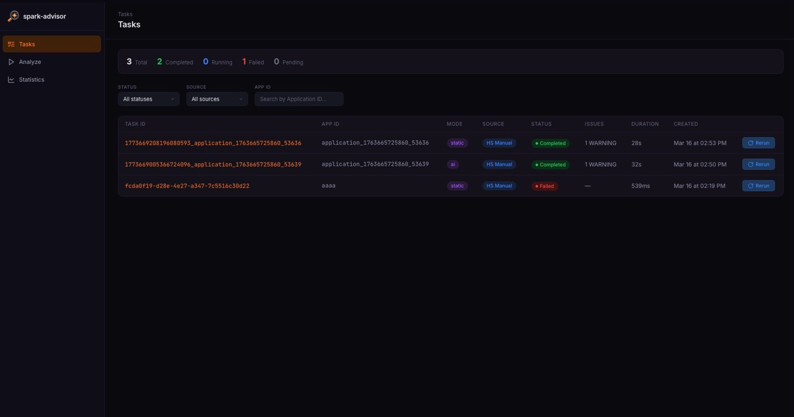
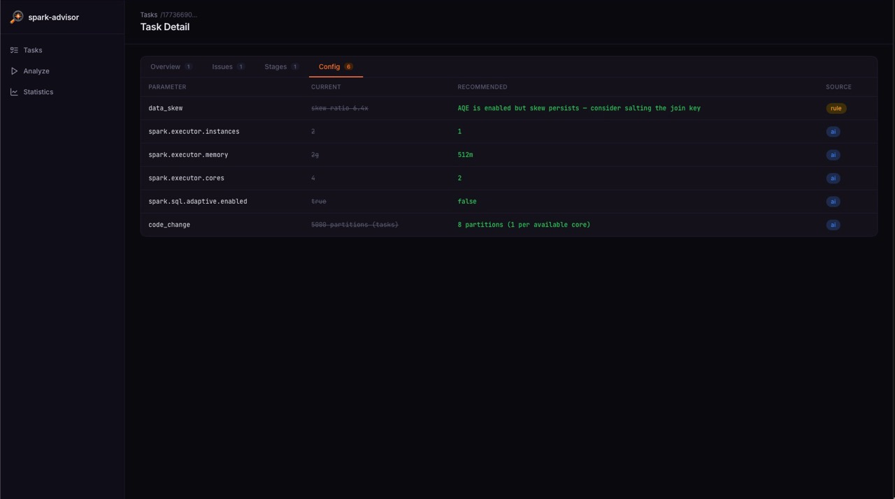
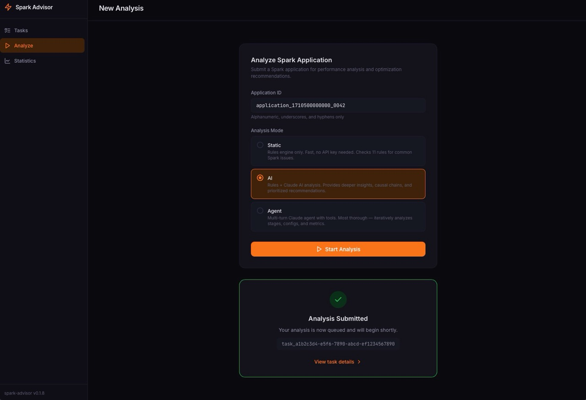
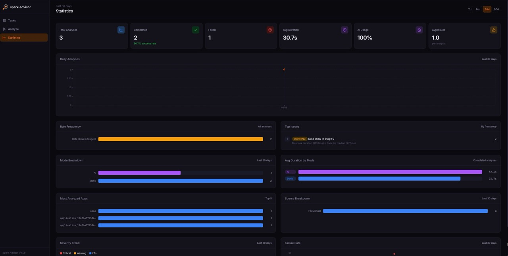

<div align="center">

  
  <p>AI-powered Apache Spark job analyzer and configuration advisor.</p>
  <p><strong>v<!-- x-release-please-version -->0.1.14<!-- /x-release-please-version --></strong></p>
  <p><em>Stop guessing Spark configs. Let data and AI tell you what's wrong.</em></p>

  <p>
    <a href="https://github.com/pstysz/spark-advisor/actions/workflows/ci.yml"></a>
    
    
    
  </p>
  <p>
    
    
    
    
    
    
  </p>

  <p>
    <a href="#features">Features</a> &bull;
    <a href="#quick-start">Quick Start</a> &bull;
    <a href="#web-dashboard">Web Dashboard</a> &bull;
    <a href="#what-it-detects">Detection Rules</a> &bull;
    <a href="#documentation">Documentation</a> &bull;
    <a href="#roadmap">Roadmap</a>
  </p>

</div>

---

```
$ spark-advisor analyze sample_event_logs/sample_etl_job.json

╭───────────────────────────── Spark Job Analysis ─────────────────────────────╮
│   App ID                application_1234567890_0001                          │
│   App Name              SampleETLJob                                         │
│   Duration              6.7 min (400s)                                       │
│   Stages                2                                                    │
│   Total Tasks           5                                                    │
│   Shuffle Partitions    200                                                  │
│   Executors             0                                                    │
╰──────────────────────────────────────────────────────────────────────────────╯

Issues Found

  🔴 CRITICAL: Data skew in Stage 1
    Max task duration (335000.0ms) is 27.9x the median (12000.0ms)
    → Enable AQE: spark.sql.adaptive.enabled=true, spark.sql.adaptive.skewJoin.enabled=true

  🔴 CRITICAL: Disk spill in Stage 1
    22.2 GB spilled to disk — data doesn't fit in memory
    → Increase spark.executor.memory or spark.sql.shuffle.partitions

  🟡 WARNING: High GC pressure in Stage 1
    GC time is 24% of total task time
    → Increase executor memory or reduce data cached per task
```

## How it works

```
Event Log / History Server  →  Rules Engine (11 rules)  →  AI Advisor (optional)  →  Report
                                  (free, fast)              (Claude API, ~$0.02)
```

1. **Data source** — parse Spark event log files or fetch from History Server REST API
2. **Rules engine** — 11 deterministic checks: data skew, disk spill, GC pressure, partition sizing, executor idle, task failures, small files, broadcast join, serializer choice, dynamic allocation, memory overhead
3. **AI advisor** (optional) — Claude analyzes metrics + rule findings, identifies causal chains between related problems, suggests concrete config values

## Features

- **11 deterministic rules** detecting data skew, GC pressure, disk spill, wrong partition count, and more
- **AI advisor** with Claude API — prioritized recommendations with causal chains and concrete config values
- **Agent mode** — multi-turn Claude analysis where AI autonomously explores job data using 6 tools
- **MCP server** — use spark-advisor as tools in Claude Desktop, Cursor, or any MCP client
- **Storage connector** — read event logs from HDFS (WebHDFS), S3, or GCS with strategy pattern and conditional Docker builds
- **REST API** — 18 endpoints with pagination, filtering, statistics, config comparison, WebSocket streaming
- **4 microservices** — NATS-based distributed pipeline (gateway, analyzer, hs-connector, storage-connector)
- **Observability** — structlog, OpenTelemetry distributed tracing (Grafana Tempo), Prometheus metrics + Grafana dashboards
- **Web dashboard** — React 19 SPA with real-time task updates, analysis submission, statistics charts
- **Rich CLI** — tables, colors, severity badges, suggested spark-defaults.conf

## Quick Start

### Prerequisites

- Python 3.12+
- [uv](https://docs.astral.sh/uv/) (modern Python package manager)

### Install

```bash
git clone https://github.com/pstysz/spark-advisor.git
cd spark-advisor
uv sync --all-packages
```

### Analyze

```bash
# Rules-only (no API key needed)
cd packages/spark-advisor-cli
uv run spark-advisor analyze ../../sample_event_logs/sample_etl_job.json --no-ai

# With AI analysis (requires ANTHROPIC_API_KEY)
export ANTHROPIC_API_KEY=sk-ant-...
uv run spark-advisor analyze ../../sample_event_logs/sample_etl_job.json
```

## Web Dashboard

React 19 SPA with real-time updates via WebSocket, served by nginx with reverse proxy to gateway API.

```bash
make up   # docker compose — all services + frontend on http://localhost:3000
```

### Tasks — analysis results with filtering and real-time status


### Task Detail — issues, stages, and config comparison


### Analyze — submit new analysis with History Server autocomplete


### Statistics — KPI cards, charts, and trend analysis


## What it detects

| Rule               | Condition                                                | Severity                            |
|--------------------|----------------------------------------------------------|-------------------------------------|
| Data skew          | max/median task duration > 5x                            | CRITICAL if >10x, WARNING if >5x    |
| Disk spill         | diskBytesSpilled > 0                                     | CRITICAL if >1GB, WARNING if >0.1GB |
| GC pressure        | GC time > 20% of task time                               | CRITICAL if >40%, WARNING if >20%   |
| Shuffle partitions | partition size far from 128MB target                     | WARNING                             |
| Executor idle      | slot utilization < 40%                                   | CRITICAL if <20%, WARNING if <40%   |
| Task failures      | failed_task_count > 0                                    | CRITICAL if >=10, WARNING if >0     |
| Small files        | avg input bytes/task < 10MB                              | CRITICAL if <1MB, WARNING if <10MB  |
| Broadcast join     | threshold disabled with shuffle stages                   | WARNING if disabled, INFO if < 10MB |
| Serializer choice  | Java serializer with shuffle stages                      | INFO                                |
| Dynamic allocation | enabled without bounds, or disabled with low utilization | WARNING                             |
| Memory overhead    | GC > 20% AND memory utilization > 80%                    | WARNING                             |

All thresholds are configurable via `Thresholds` model.

## Documentation

| Area | Description |
|------|-------------|
| [CLI Reference](packages/spark-advisor-cli/README.md) | Full CLI usage, flags, examples |
| [Gateway / REST API](packages/spark-advisor-gateway/README.md) | 18 endpoints, curl examples, microservices setup |
| [MCP Server](docs/mcp-setup.md) | Claude Desktop, Cursor, Claude Code integration |
| [Frontend Dashboard](packages/spark-advisor-frontend/README.md) | React SPA development guide |
| [Helm / Kubernetes](charts/README.md) | Deployment, Minikube, Ingress, chart structure |
| [Monitoring](monitoring/README.md) | Prometheus, Grafana dashboards, Tempo tracing |
| [Architecture](docs/architecture.md) | System design, data flows, NATS subjects, diagrams |
| [Development](docs/development.md) | Tech stack, make commands, testing, environment variables |
| [Analyzer](packages/spark-advisor-analyzer/README.md) | Rules + AI worker configuration |
| [HS Connector](packages/spark-advisor-hs-connector/README.md) | History Server integration and polling |
| [Storage Connector](packages/spark-advisor-storage-connector/README.md) | HDFS/S3/GCS event log reader |
| [Parser](packages/spark-advisor-parser/README.md) | Shared event log parser (compression support) |
| [Models](packages/spark-advisor-models/README.md) | Pydantic data contracts |
| [Rules Engine](packages/spark-advisor-rules/README.md) | 11 deterministic analysis rules |

## Roadmap

- [x] Streaming event log parser (.json, .json.gz)
- [x] History Server REST API client
- [x] Rules engine (11 rules)
- [x] AI advisor with Claude API (tool use + structured output)
- [x] Rich CLI with suggested spark-defaults.conf
- [x] uv monorepo (9 packages)
- [x] 4 NATS-based microservices (gateway, analyzer, hs-connector, storage-connector)
- [x] Agent mode — multi-turn Claude analysis with 6 tools
- [x] MCP server — Claude Desktop / Cursor integration (7 tools)
- [x] GitHub Actions CI (lint + test + Helm lint)
- [x] Helm charts for Kubernetes deployment (umbrella chart + 9 subcharts)
- [x] Docker images published to ghcr.io on release
- [x] PyPI release (`pip install spark-advisor`)
- [x] Task persistence (SQLite + SQLAlchemy async)
- [x] Task deduplication with rerun support
- [x] Dashboard REST API (18 endpoints + WebSocket)
- [x] Statistics aggregation (summary, rule frequency, daily volume, top issues)
- [x] OpenAPI schema with examples and tagged endpoints
- [x] Web dashboard — React 19 SPA with real-time updates, statistics, analysis submission
- [x] Structured logging (structlog) with JSON/console rendering
- [x] OpenTelemetry distributed tracing (W3C Traceparent via NATS headers, Grafana Tempo)
- [x] Prometheus metrics + Grafana dashboards (3 dashboards: main, NATS, rules)
- [x] Extended health checks (NATS connectivity, SQLite)
- [x] Storage connector — HDFS/S3/GCS event log reader with strategy pattern
- [x] Event log parser as shared package (supports .json, .gz, .lz4, .snappy, .zstd)
- [ ] Terminal demo GIF

## License

Apache 2.0
