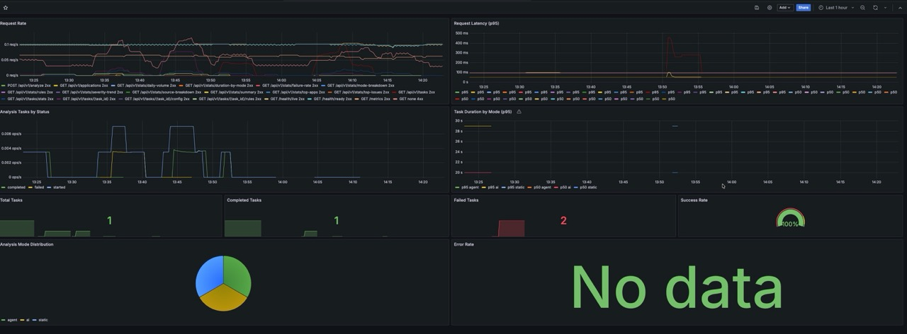
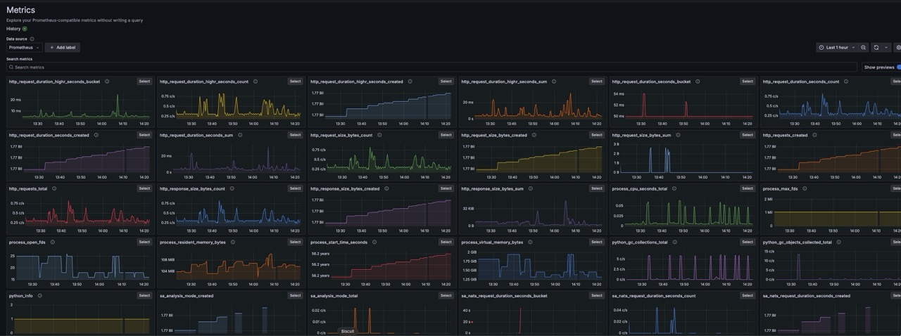
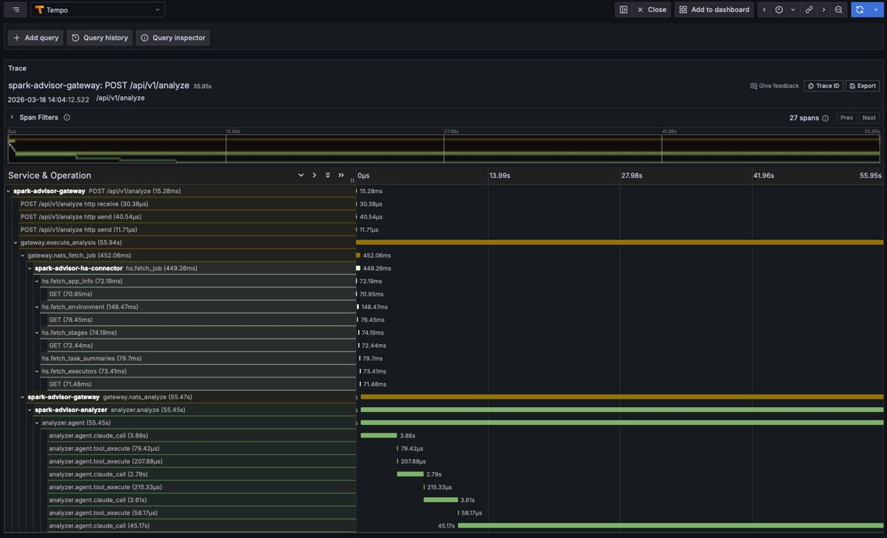

[↩ spark-advisor](../README.md)

# Monitoring

## Overview

Docker Compose monitoring stack with Prometheus, Grafana, and Grafana Tempo for the spark-advisor microservices. Provides metrics collection, dashboard visualization, and distributed trace storage.

## Quick Start

```bash
# Enable metrics + tracing in services
SA_GATEWAY_METRICS_ENABLED=true SA_OTEL_ENABLED=true make up

# Start monitoring stack
make monitoring-up

# Stop monitoring
make monitoring-down
```

## Components

| Component | Port | URL | Purpose |
|-----------|------|-----|---------|
| Prometheus | 9090 | http://localhost:9090 | Metrics collection and alerting |
| Grafana | 3001 | http://localhost:3001 | Dashboard visualization |
| Tempo | 4317 (gRPC), 3200 (HTTP) | — | Distributed trace storage |

## Grafana Dashboards

Three pre-built dashboards are provisioned automatically:

| Dashboard | File | Description |
|-----------|------|-------------|
| Spark Advisor | spark-advisor.json | Task throughput, error rate, duration, success rate, analysis mode distribution |
| NATS Latency | spark-advisor-nats.json | NATS request-reply latency (fetch job, analyze) p50/p95, request rate |
| Rule Violations | spark-advisor-rules.json | Top rule violations, violations by severity, violation rate |

### Spark Advisor Dashboard


### Prometheus Metrics Explorer


## Prometheus Metrics

Collected by the gateway service:

| Metric | Type | Labels | Description |
|--------|------|--------|-------------|
| sa_tasks_total | Counter | status | Total tasks by status |
| sa_task_duration_seconds | Histogram | — | Task execution duration |
| sa_analysis_mode_total | Counter | mode | Analyses by mode (static/ai/agent) |
| sa_nats_request_duration_seconds | Histogram | operation | NATS request-reply latency |
| sa_rules_violations_total | Counter | rule, severity | Rule violations detected |

Plus auto-instrumented HTTP metrics via `prometheus-fastapi-instrumentator`.

## File Structure

```
monitoring/
├── docker-compose.monitoring.yaml   # Prometheus + Grafana + Tempo services
├── prometheus.yml                    # Prometheus scrape config
├── tempo.yaml                       # Tempo configuration
└── grafana/
    └── dashboards/
        ├── spark-advisor.json       # Main dashboard
        ├── spark-advisor-nats.json  # NATS latency dashboard
        └── spark-advisor-rules.json # Rule violations dashboard
```

## Tracing

With tracing enabled, structlog logs include `trace_id` and `span_id` fields. Traces are visible in Grafana via the Tempo datasource. W3C Traceparent headers propagate across NATS messages.

### Distributed trace — full analysis pipeline (gateway → hs-connector → analyzer)


## See also

- Helm charts (production deployment): [../charts/README.md](../charts/README.md)
- Architecture: [../docs/architecture.md](../docs/architecture.md)
- Gateway metrics: [../packages/spark-advisor-gateway/README.md](../packages/spark-advisor-gateway/README.md)
